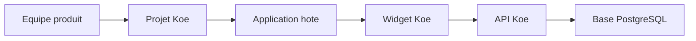

# Koe

Koe vous permet d'ajouter un widget de support dans votre propre application SaaS. Vos utilisateurs peuvent signaler un bug, proposer une evolution et voter sur votre roadmap sans quitter votre interface.

Le socle reellement exploitable aujourd'hui couvre le **widget embarquable** et l'**API publique**. Le **dashboard** existe deja, mais il reste surtout un squelette en attente de branchement.

## Table des matieres

- [A quoi sert Koe](#a-quoi-sert-koe)
- [Ce que vous devez deployer](#ce-que-vous-devez-deployer)
- [Ce que vous devez preparer cote projet](#ce-que-vous-devez-preparer-cote-projet)
- [Demarrage rapide](#demarrage-rapide)
- [Integrer Koe dans une application React](#integrer-koe-dans-une-application-react)
- [Integrer Koe sans framework](#integrer-koe-sans-framework)
- [Options du widget](#options-du-widget)
- [Verification d'identite](#verification-didentite)
- [Parcours d'integration](#parcours-dintegration)
- [Ce qui est disponible aujourd'hui](#ce-qui-est-disponible-aujourdhui)
- [Deployer votre instance](#deployer-votre-instance)
- [Developper ce depot](#developper-ce-depot)
- [Stack technique](#stack-technique)
- [Documentation complementaire](#documentation-complementaire)
- [Licence](#licence)

## A quoi sert Koe

- Ajouter un point de contact unique dans votre application.
- Recevoir des bugs avec le contexte navigateur capture automatiquement.
- Collecter des demandes d'evolution depuis la meme interface.
- Laisser vos utilisateurs voter sur les demandes deja ouvertes.
- Reutiliser le meme widget sur plusieurs applications via des `projectKey` differents.

## Ce que vous devez deployer

Pour utiliser Koe dans votre propre application, vous devez deployer ou consommer quatre briques.

- **`packages/api`** : l'API Node qui recoit les bugs, les evolutions et les votes.
- **PostgreSQL** : la base qui stocke les projets, tickets et votes.
- **`@wifsimster/koe`** ou **`koe.iife.js`** : le widget a embarquer dans votre frontend.
- **`packages/dashboard`** : optionnel pour le moment. Le back-office n'est pas encore branche sur des donnees reelles.

## Ce que vous devez preparer cote projet

Chaque application hote doit etre rattachee a un projet Koe.

| Element                       | Obligatoire              | Role                                                        |
| ----------------------------- | ------------------------ | ----------------------------------------------------------- |
| `projectKey`                  | Oui                      | Identifie l'application qui embarque le widget.             |
| `allowedOrigins`              | Oui en production        | Liste les domaines autorises a appeler l'API.               |
| `identitySecret`              | Recommande               | Sert a signer `user.id` cote backend hote.                  |
| `requireIdentityVerification` | Recommande en production | Rend `userHash` obligatoire pour accepter une contribution. |

Points importants :

- Aujourd'hui, la creation du projet se fait directement dans la table `projects`.
- Si `allowedOrigins` est vide, le projet reste permissif.
- Si vous avez plusieurs applications ou plusieurs domaines, creez un projet par contexte d'usage.
- Le `projectKey` est public. Ce n'est pas un secret.

## Demarrage rapide

1. Deployez `packages/api` et une base PostgreSQL.
2. Creez un projet Koe avec un `projectKey`, des `allowedOrigins` et un `identitySecret`.
3. Integrez le widget dans votre frontend avec `@wifsimster/koe` ou `koe.iife.js`.
4. Passez un `user.id` stable pour distinguer les signalements et les votes.
5. Generez `userHash` dans votre backend si vous activez la verification d'identite.

## Integrer Koe dans une application React

Le mode React est le plus simple si votre application utilise deja React.

```tsx
import { KoeWidget } from '@wifsimster/koe';
import '@wifsimster/koe/style.css';

export function AppShell({ currentUser, koeUserHash }) {
  return (
    <>
      <Routes />
      <KoeWidget
        projectKey="acme-web"
        apiUrl="https://api.support.acme.com"
        user={{
          id: currentUser.id,
          name: currentUser.name,
          email: currentUser.email,
          metadata: { plan: currentUser.plan },
        }}
        userHash={koeUserHash}
        position="bottom-right"
        theme={{ accentColor: '#4f46e5', mode: 'auto' }}
      />
    </>
  );
}
```

Bonnes pratiques :

- Montez `KoeWidget` une seule fois, pres de la racine de votre application.
- Importez `@wifsimster/koe/style.css`, sinon le widget ne sera pas style.
- Renseignez `apiUrl` si vous hebergez votre propre API.
- Fournissez un `user.id` stable. Sans cela, le widget retombe sur `anonymous`.

## Integrer Koe sans framework

Le mode autonome convient a une application non React, a une page marketing ou a une integration via script tag.

```html
<link rel="stylesheet" href="https://cdn.votre-domaine.com/koe/style.css" />
<script src="https://cdn.votre-domaine.com/koe/koe.iife.js"></script>
<script>
  Koe.init({
    projectKey: 'acme-web',
    apiUrl: 'https://api.support.acme.com',
    user: {
      id: 'user_123',
      name: 'Jane Doe',
      email: 'jane@example.com',
    },
    userHash: 'hash-fourni-par-votre-backend',
  });
</script>
```

Points importants :

- Chargez **les deux assets** : `style.css` et `koe.iife.js`.
- La build autonome expose `window.Koe` avec `init()` et `destroy()`.
- Cette build embarque React. Vous n'avez pas besoin de React dans l'application hote.

## Options du widget

| Option       | Obligatoire          | Valeur par defaut     | Usage                                                    |
| ------------ | -------------------- | --------------------- | -------------------------------------------------------- |
| `projectKey` | Oui                  | -                     | Rattache le widget au bon projet.                        |
| `user`       | Non, mais recommande | `anonymous`           | Identifie le contributeur dans les tickets et les votes. |
| `userHash`   | Selon le projet      | -                     | Prouve l'identite du contributeur.                       |
| `apiUrl`     | Non                  | `https://api.koe.dev` | Pointe vers l'API Koe.                                   |
| `position`   | Non                  | `bottom-right`        | Place le lanceur dans un coin de l'ecran.                |
| `theme`      | Non                  | indigo, mode `auto`   | Regle couleur, mode et rayon.                            |
| `features`   | Non                  | toutes actives        | Active ou masque les onglets bugs, evolutions et chat.   |
| `locale`     | Non                  | anglais               | Remplace les textes d'interface.                         |

Conseils pratiques :

- Passez toujours `apiUrl` si vous exploitez votre propre instance.
- Passez un `user.id` stable si vous voulez un vote par utilisateur.
- Utilisez `features.chat = false` si vous ne voulez pas exposer un onglet encore partiel.

## Verification d'identite

La verification d'identite evite qu'un tiers usurpe un utilisateur en reutilisant seulement le `projectKey`.

Le principe est simple :

1. Votre backend genere un HMAC a partir de `user.id` et de `identitySecret`.
2. Votre frontend passe ce hash au widget via `userHash`.
3. Le widget envoie automatiquement `X-Koe-User-Hash` a l'API.
4. L'API recalcule le hash attendu avant d'accepter la requete.

Exemple backend :

```ts
import { createHmac } from 'node:crypto';

const userHash = createHmac('sha256', process.env.KOE_IDENTITY_SECRET)
  .update(user.id)
  .digest('hex');
```

A retenir :

- Ne construisez jamais `userHash` dans le navigateur.
- Si `requireIdentityVerification` vaut `true`, un hash absent ou faux renvoie `401`.
- Le `projectKey` reste public. Le vrai secret est `identitySecret`.

## Parcours d'integration



Vous creez d'abord un projet Koe. Votre application initialise ensuite le widget avec le bon `projectKey`. Le widget appelle l'API, qui verifie le projet, l'origine et l'identite avant de stocker les tickets.

## Ce qui est disponible aujourd'hui

- **Bugs** : fonctionnels, avec metadonnees navigateur et `screenshotUrl`.
- **Demandes d'evolution** : fonctionnelles.
- **Votes** : fonctionnels sur la roadmap publique.
- **Chat** : onglet visible, mais conversation encore locale et sans temps reel.
- **Dashboard** : navigation presente, mais pages encore placeholder.

## Deployer votre instance

Commandes utiles depuis la racine du monorepo :

- `pnpm install`
- `cp packages/api/.env.example packages/api/.env`
- `pnpm --filter @koe/api db:generate`
- `pnpm --filter @koe/api db:migrate`
- `pnpm build`
- `pnpm --filter @koe/api start`

Variables minimales pour l'API :

- `DATABASE_URL`
- `PORT`
- `BETTER_AUTH_SECRET`
- `BETTER_AUTH_URL`

Repartition recommande pour une premiere mise en production :

- **API** sur Railway, Render ou Fly.io.
- **Base PostgreSQL** sur un service manage.
- **Widget React** consomme via npm.
- **Widget autonome** servi depuis votre CDN avec `style.css` et `koe.iife.js`.

## Developper ce depot

- `pnpm install`
- `pnpm turbo run build`
- `pnpm dev`
- `pnpm turbo run typecheck`
- `pnpm turbo run lint`
- `pnpm turbo run test`

Les commits suivent **Conventional Commits**. Consultez `CONTRIBUTING.md` pour le format attendu et le lien avec la release npm.

## Stack technique

- **Widget** : React 19, TypeScript, Vite, Tailwind CSS.
- **API** : Hono, Zod, Drizzle ORM, PostgreSQL.
- **Monorepo** : `pnpm` workspaces et Turborepo.
- **Release** : GitHub Actions, Changesets et publication npm du package `@wifsimster/koe`.

## Documentation complementaire

| Document                                                 | Description                                                                     |
| -------------------------------------------------------- | ------------------------------------------------------------------------------- |
| [Integration du widget](docs/integration-widget.md)      | Modes React et script autonome, options de configuration et points d'attention. |
| [Verification d'identite](docs/verification-identite.md) | Flux HMAC entre le backend hote, le widget et l'API.                            |
| [API widget](docs/api-widget.md)                         | Routes publiques, headers requis et limites de l'API.                           |
| [Schema de base de donnees](docs/schema-base-donnees.md) | Tables centrales, votes et elements prepares pour le chat.                      |
| [Statut du dashboard](docs/statut-dashboard.md)          | Etat reel du back-office et parties encore placeholder.                         |
| [Release npm](docs/release-npm.md)                       | Pipeline CI/CD et publication du package public.                                |

## Licence

MIT.
