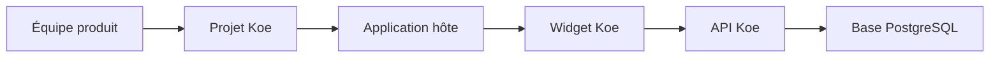

# Koe

Koe vous permet d'ajouter un widget de support dans votre propre application SaaS. Vos utilisateurs peuvent signaler un bug, proposer une évolution et voter sur votre roadmap sans quitter votre interface.

Le socle réellement exploitable aujourd'hui couvre le **widget embarquable** et l'**API publique**. Le **dashboard** existe déjà, mais il reste surtout un squelette en attente de branchement.

## Table des matières

- [À quoi sert Koe](#à-quoi-sert-koe)
- [Ce que vous devez déployer](#ce-que-vous-devez-déployer)
- [Ce que vous devez préparer côté projet](#ce-que-vous-devez-préparer-côté-projet)
- [Démarrage rapide](#démarrage-rapide)
- [Intégrer Koe dans une application React](#intégrer-koe-dans-une-application-react)
- [Intégrer Koe sans framework](#intégrer-koe-sans-framework)
- [Options du widget](#options-du-widget)
- [Vérification d'identité](#vérification-didentité)
- [Parcours d'intégration](#parcours-dintégration)
- [Ce qui est disponible aujourd'hui](#ce-qui-est-disponible-aujourdhui)
- [Déployer votre instance](#déployer-votre-instance)
- [Développer ce dépôt](#développer-ce-dépôt)
- [Stack technique](#stack-technique)
- [Documentation complémentaire](#documentation-complémentaire)
- [Licence](#licence)

## À quoi sert Koe

- Ajouter un point de contact unique dans votre application.
- Recevoir des bugs avec le contexte navigateur capturé automatiquement.
- Collecter des demandes d'évolution depuis la même interface.
- Laisser vos utilisateurs voter sur les demandes déjà ouvertes.
- Réutiliser le même widget sur plusieurs applications via des `projectKey` différents.

## Ce que vous devez déployer

Pour utiliser Koe dans votre propre application, vous devez déployer ou consommer quatre briques.

- **`packages/api`** : l'API Node qui reçoit les bugs, les évolutions et les votes.
- **PostgreSQL** : la base qui stocke les projets, tickets et votes.
- **`@wifsimster/koe`** ou **`koe.iife.js`** : le widget à embarquer dans votre frontend.
- **`packages/dashboard`** : optionnel pour le moment. Le back-office n'est pas encore branché sur des données réelles.

## Ce que vous devez préparer côté projet

Chaque application hôte doit être rattachée à un projet Koe.

| Élément                       | Obligatoire              | Rôle                                                        |
| ----------------------------- | ------------------------ | ----------------------------------------------------------- |
| `projectKey`                  | Oui                      | Identifie l'application qui embarque le widget.             |
| `allowedOrigins`              | Oui en production        | Liste les domaines autorisés à appeler l'API.               |
| `identitySecret`              | Recommandé               | Sert à signer `user.id` côté backend hôte.                  |
| `requireIdentityVerification` | Recommandé en production | Rend `userHash` obligatoire pour accepter une contribution. |

Points importants :

- Aujourd'hui, la création du projet se fait directement dans la table `projects`.
- Si `allowedOrigins` est vide, le projet reste permissif.
- Si vous avez plusieurs applications ou plusieurs domaines, créez un projet par contexte d'usage.
- Le `projectKey` est public. Ce n'est pas un secret.

## Démarrage rapide

1. Déployez `packages/api` et une base PostgreSQL.
2. Créez un projet Koe avec un `projectKey`, des `allowedOrigins` et un `identitySecret`.
3. Intégrez le widget dans votre frontend avec `@wifsimster/koe` ou `koe.iife.js`.
4. Passez un `user.id` stable pour distinguer les signalements et les votes.
5. Générez `userHash` dans votre backend si vous activez la vérification d'identité.

## Intégrer Koe dans une application React

Le mode React est le plus simple si votre application utilise déjà React.

```tsx
import { KoeWidget } from '@wifsimster/koe';
import '@wifsimster/koe/style.css';

export function AppShell({ currentUser, koeUserHash }) {
  return (
    <>
      <Routes />
      <KoeWidget
        projectKey="acme-web"
        apiUrl="https://api.support.acme.com"
        user={{
          id: currentUser.id,
          name: currentUser.name,
          email: currentUser.email,
          metadata: { plan: currentUser.plan },
        }}
        userHash={koeUserHash}
        position="bottom-right"
        theme={{ accentColor: '#4f46e5', mode: 'auto' }}
      />
    </>
  );
}
```

Bonnes pratiques :

- Montez `KoeWidget` une seule fois, près de la racine de votre application.
- Importez `@wifsimster/koe/style.css`, sinon le widget ne sera pas stylé.
- Renseignez `apiUrl` si vous hébergez votre propre API.
- Fournissez un `user.id` stable. Sans cela, le widget retombe sur `anonymous`.

## Intégrer Koe sans framework

Le mode autonome convient à une application non React, à une page marketing ou à une intégration via script tag.

```html
<link rel="stylesheet" href="https://cdn.votre-domaine.com/koe/style.css" />
<script src="https://cdn.votre-domaine.com/koe/koe.iife.js"></script>
<script>
  Koe.init({
    projectKey: 'acme-web',
    apiUrl: 'https://api.support.acme.com',
    user: {
      id: 'user_123',
      name: 'Jane Doe',
      email: 'jane@example.com',
    },
    userHash: 'hash-fourni-par-votre-backend',
  });
</script>
```

Points importants :

- Chargez **les deux assets** : `style.css` et `koe.iife.js`.
- La build autonome expose `window.Koe` avec `init()` et `destroy()`.
- Cette build embarque React. Vous n'avez pas besoin de React dans l'application hôte.

## Options du widget

| Option       | Obligatoire          | Valeur par défaut     | Usage                                                    |
| ------------ | -------------------- | --------------------- | -------------------------------------------------------- |
| `projectKey` | Oui                  | -                     | Rattache le widget au bon projet.                        |
| `user`       | Non, mais recommandé | `anonymous`           | Identifie le contributeur dans les tickets et les votes. |
| `userHash`   | Selon le projet      | -                     | Prouve l'identité du contributeur.                       |
| `apiUrl`     | Non                  | `https://api.koe.dev` | Pointe vers l'API Koe.                                   |
| `position`   | Non                  | `bottom-right`        | Place le lanceur dans un coin de l'écran.                |
| `theme`      | Non                  | indigo, mode `auto`   | Règle couleur, mode et rayon.                            |
| `features`   | Non                  | toutes activées       | Active ou masque les onglets bugs, évolutions et chat.   |
| `locale`     | Non                  | anglais               | Remplace les textes d'interface.                         |

Conseils pratiques :

- Passez toujours `apiUrl` si vous exploitez votre propre instance.
- Passez un `user.id` stable si vous voulez un vote par utilisateur.
- Utilisez `features.chat = false` si vous ne voulez pas exposer un onglet encore partiel.

## Vérification d'identité

La vérification d'identité évite qu'un tiers usurpe un utilisateur en réutilisant seulement le `projectKey`.

Le principe est simple :

1. Votre backend génère un HMAC à partir de `user.id` et de `identitySecret`.
2. Votre frontend passe ce hash au widget via `userHash`.
3. Le widget envoie automatiquement `X-Koe-User-Hash` à l'API.
4. L'API recalcule le hash attendu avant d'accepter la requête.

Exemple backend :

```ts
import { createHmac } from 'node:crypto';

const userHash = createHmac('sha256', process.env.KOE_IDENTITY_SECRET)
  .update(user.id)
  .digest('hex');
```

À retenir :

- Ne construisez jamais `userHash` dans le navigateur.
- Si `requireIdentityVerification` vaut `true`, un hash absent ou faux renvoie `401`.
- Le `projectKey` reste public. Le vrai secret est `identitySecret`.

## Parcours d'intégration



Vous créez d'abord un projet Koe. Votre application initialise ensuite le widget avec le bon `projectKey`. Le widget appelle l'API, qui vérifie le projet, l'origine et l'identité avant de stocker les tickets.

## Ce qui est disponible aujourd'hui

- **Bugs** : fonctionnels, avec métadonnées navigateur et `screenshotUrl`.
- **Demandes d'évolution** : fonctionnelles.
- **Votes** : fonctionnels sur la roadmap publique.
- **Chat** : onglet visible, mais conversation encore locale et sans temps réel.
- **Dashboard** : navigation présente, mais pages encore placeholder.

## Déployer votre instance

Commandes utiles depuis la racine du monorepo :

- `pnpm install`
- `cp packages/api/.env.example packages/api/.env`
- `pnpm --filter @koe/api db:generate`
- `pnpm --filter @koe/api db:migrate`
- `pnpm build`
- `pnpm --filter @koe/api start`

Variables minimales pour l'API :

- `DATABASE_URL`
- `PORT`
- `BETTER_AUTH_SECRET`
- `BETTER_AUTH_URL`

Répartition recommandée pour une première mise en production :

- **API** sur Railway, Render ou Fly.io.
- **Base PostgreSQL** sur un service managé.
- **Widget React** consommé via npm.
- **Widget autonome** servi depuis votre CDN avec `style.css` et `koe.iife.js`.

## Développer ce dépôt

- `pnpm install`
- `pnpm turbo run build`
- `pnpm dev`
- `pnpm turbo run typecheck`
- `pnpm turbo run lint`
- `pnpm turbo run test`

Les commits suivent **Conventional Commits**. Consultez `CONTRIBUTING.md` pour le format attendu et le lien avec la release.

## Stack technique

- **Widget** : React 19, TypeScript, Vite, Tailwind CSS.
- **API** : Hono, Zod, Drizzle ORM, PostgreSQL.
- **Monorepo** : `pnpm` workspaces et Turborepo.
- **Release** : GitHub Actions et `semantic-release` pour les tags et GitHub Releases du widget.

## Documentation complémentaire

| Document                                                 | Description                                                                     |
| -------------------------------------------------------- | ------------------------------------------------------------------------------- |
| [Intégration du widget](docs/integration-widget.md)      | Modes React et script autonome, options de configuration et points d'attention. |
| [Vérification d'identité](docs/verification-identite.md) | Flux HMAC entre le backend hôte, le widget et l'API.                            |
| [API widget](docs/api-widget.md)                         | Routes publiques, headers requis et limites de l'API.                           |
| [Schéma de base de données](docs/schema-base-donnees.md) | Tables centrales, votes et éléments préparés pour le chat.                      |
| [Statut du dashboard](docs/statut-dashboard.md)          | État réel du back-office et parties encore placeholder.                         |
| [Release](docs/release-npm.md)                           | Pipeline CI/CD et création des GitHub Releases.                                 |

## Licence

MIT.
