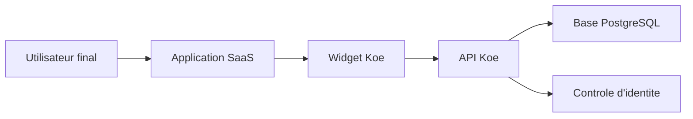
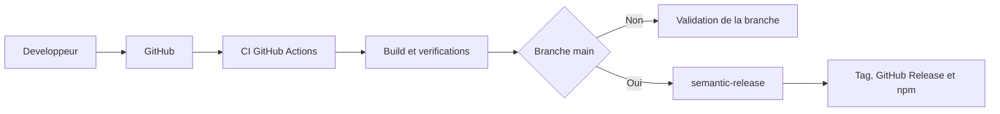

# Koe

Koe aide les equipes SaaS a recueillir les retours utilisateurs dans chaque application. Le socle actuel couvre le widget et l'API (interface de programmation) publique. Le back-office reste a connecter.

## Table des matieres

- [A quoi sert ce produit ?](#a-quoi-sert-ce-produit-)
- [Fonctionnalites principales](#fonctionnalites-principales)
- [Utilisation du widget](#utilisation-du-widget)
- [Comment ca fonctionne](#comment-ca-fonctionne)
- [Environnements](#environnements)
- [Deploiement](#deploiement)
- [Stack technique](#stack-technique)
- [Demarrage rapide](#demarrage-rapide)
- [Developpement](#developpement)
- [Structure du monorepo](#structure-du-monorepo)
- [Documentation complementaire](#documentation-complementaire)
- [Feuille de route](#feuille-de-route)
- [Licence](#licence)

### Documentation technique

| Document                                                 | Description                                               |
| -------------------------------------------------------- | --------------------------------------------------------- |
| [API widget](docs/api-widget.md)                         | Endpoints publics du widget, en-tetes requis et reponses. |
| [Verification d'identite](docs/verification-identite.md) | Flux HMAC entre le backend hote, le widget et l'API.      |
| [Schema de base de donnees](docs/schema-base-donnees.md) | Tables centrales, relations et decisions de stockage.     |
| [Integration du widget](docs/integration-widget.md)      | Modes d'integration React et script autonome.             |
| [Statut du dashboard](docs/statut-dashboard.md)          | Etat reel du back-office et elements encore placeholder.  |
| [Release npm](docs/release-npm.md)                       | Pipeline CI/CD et publication du package public.          |

## A quoi sert ce produit ?

- Offrir un point d'entree unique pour signaler un bug ou proposer une amelioration.
- Reduire les echanges de clarification grace au contexte navigateur collecte automatiquement.
- Prioriser les evolutions grace a un vote public par demande.
- Preparer un suivi multi-projets avec un widget reutilisable dans plusieurs applications SaaS.

## Fonctionnalites principales

- **Signalement de bugs** : vos utilisateurs envoient un incident avec le contexte navigateur capture automatiquement.
- **Demandes d'evolution** : vos utilisateurs partagent leurs idees depuis le meme point de contact.
- **Vote public** : vous reperez les demandes les plus attendues sans calcul manuel.
- **Integration souple** : vous embarquez le widget via React ou via un script autonome.
- **Controles de securite** : vous filtrez les origines autorisees et pouvez verifier l'identite des contributeurs.

## Utilisation du widget

- Installer le package public avec `npm install @wifsimster/koe`.
- Integrer le widget dans une application React avec le composant `KoeWidget`.
- Integrer le widget sans framework via la build autonome `koe.iife.js`.
- Fournir `userHash` depuis votre backend si vous activez la verification d'identite.
- Utiliser `projectKey` pour rattacher chaque application au bon projet.

## Comment ca fonctionne

L'utilisateur agit depuis l'application SaaS. Le widget transmet les bugs et les idees a l'API. L'API valide le projet. Elle controle aussi l'identite si besoin avant l'enregistrement.

## Environnements

| Environnement | URL                               | Description                                              |
| ------------- | --------------------------------- | -------------------------------------------------------- |
| Developpement | `http://localhost:5173`           | Dashboard local. API locale sur `http://localhost:8787`. |
| Staging       | `https://staging.koe.example.com` | Placeholder a confirmer pour la pre-production.          |
| Production    | `https://app.koe.example.com`     | Placeholder a confirmer pour la production.              |

## Deploiement

Chaque push lance l'installation, le build et le typage. Les etapes lint et test existent deja. Elles restent non bloquantes. Sur `main`, `semantic-release` analyse les commits, publie le widget sur npm puis cree le tag et la GitHub Release.

## Stack technique

- **Frontends :** widget et dashboard en React 19, TypeScript, Vite et Tailwind CSS.
- **Backend :** API Hono avec validation Zod et reponses JSON normalisees.
- **Base de donnees :** PostgreSQL avec Drizzle ORM et schema centralise dans `packages/api`.
- **Monorepo :** `pnpm` workspaces et Turborepo pour builder les packages ensemble.
- **Publication :** GitHub Actions et `semantic-release` pour verifier le code et publier le widget npm.

## Demarrage rapide

- Installer les dependances avec `pnpm install`.
- Preparer l'API locale avec `cp packages/api/.env.example packages/api/.env`.
- Generer les fichiers Drizzle avec `pnpm --filter @koe/api db:generate`.
- Appliquer les migrations avec `pnpm --filter @koe/api db:migrate`.
- Lancer le monorepo avec `pnpm dev`.
- Lancer un package cible avec `pnpm --filter @koe/api dev`, `pnpm --filter @koe/dashboard dev` ou `pnpm --filter @wifsimster/koe dev`.

## Developpement

- Construire tous les packages avec `pnpm build`.
- Verifier les types avec `pnpm typecheck`.
- Executer le lint disponible avec `pnpm lint`.
- Ouvrir Drizzle Studio avec `pnpm --filter @koe/api db:studio`.
- Verifier le pipeline de release avec `pnpm release:dry`.
- La commande `pnpm test` est prevue, mais aucune suite n'est encore branchee.

## Structure du monorepo

| Package              | Role                                                    |
| -------------------- | ------------------------------------------------------- |
| `packages/widget`    | Widget embarquable publie sur npm.                      |
| `packages/api`       | API publique, securite projet et acces PostgreSQL.      |
| `packages/dashboard` | Back-office React deja present, mais encore a brancher. |
| `packages/shared`    | Types partages et capture de metadonnees navigateur.    |

## Documentation complementaire

| Document                                                 | Usage                                                           |
| -------------------------------------------------------- | --------------------------------------------------------------- |
| [API widget](docs/api-widget.md)                         | Comprendre les endpoints, headers et limites de l'API publique. |
| [Verification d'identite](docs/verification-identite.md) | Integrer `X-Koe-User-Hash` correctement.                        |
| [Schema de base de donnees](docs/schema-base-donnees.md) | Visualiser le modele de donnees actif et le futur chat.         |
| [Integration du widget](docs/integration-widget.md)      | Choisir et configurer le bon mode d'integration.                |
| [Statut du dashboard](docs/statut-dashboard.md)          | Distinguer le back-office actif du back-office prepare.         |
| [Release npm](docs/release-npm.md)                       | Suivre la verification et la publication du package public.     |

## Feuille de route

- **Fait :** collecte de bugs avec metadonnees navigateur.
- **Fait :** demandes d'evolution et vote public.
- **En cours :** back-office React pret a etre relie a l'API d'administration.
- **Prepare :** modele de chat et ecrans dedies, sans temps reel branche.
- **A venir :** parcours d'administration complet et automatisation des tests.

## Licence

MIT.
