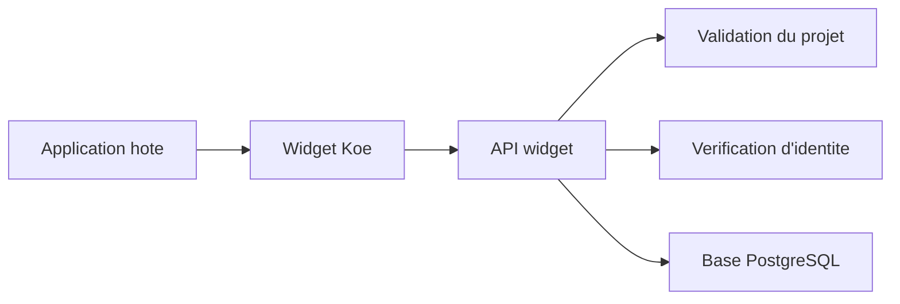

# API Widget

Ce document presente l'API publique consommee par le widget. Il aide les equipes produit et integration a comprendre ce qui est disponible aujourd'hui.

## Pourquoi cette API existe

- Centraliser les bugs et les demandes d'evolution.
- Associer chaque envoi a un projet SaaS precis.
- Exposer un vote public simple pour la roadmap.
- Fournir un socle stable avant l'API d'administration.

## Vue d'ensemble



L'application hote embarque le widget. Le widget appelle l'API publique. L'API verifie le projet et l'identite avant d'ecrire en base.

## Headers obligatoires

| Header                           | Quand                                | Role                                        |
| -------------------------------- | ------------------------------------ | ------------------------------------------- |
| `X-Koe-Project-Key`              | Toutes les routes widget             | Rattache la requete au bon projet.          |
| `Content-Type: application/json` | Requetes `POST`                      | Transporte les formulaires du widget.       |
| `X-Koe-User-Hash`                | Schema v1 si verification active     | HMAC du `reporter.id`. Retro-compatible.    |
| `X-Koe-Identity-Token`           | Schema v2 si verification active     | Token signe avec `iat`, `nonce` et `kid`.   |

## Endpoints disponibles

| Methode | Route                                  | Usage                                         | Point cle                                  |
| ------- | -------------------------------------- | --------------------------------------------- | ------------------------------------------ |
| `GET`   | `/health`                              | Verifier la disponibilite de l'API            | Retourne `status: ok`.                     |
| `POST`  | `/v1/widget/bugs`                      | Creer un signalement de bug                   | Attend le contexte navigateur.             |
| `POST`  | `/v1/widget/features`                  | Creer une demande d'evolution                 | Cree aussi un compteur de vote a `0`.      |
| `GET`   | `/v1/widget/features`                  | Lister la roadmap publique                    | Accepte `userId` pour calculer `hasVoted`. |
| `POST`  | `/v1/widget/features/:id/vote`         | Ajouter ou retirer un vote                    | Le second appel retire le vote.            |
| `GET`   | `/v1/widget/my-requests`               | Lister les tickets envoyes par l'appelant     | Scope par `reporterId = userId`.           |
| `GET`   | `/r/:projectKey`                       | Page HTML publique de la roadmap curatee      | SSR, balises OpenGraph, sans JavaScript.   |
| `GET`   | `/v1/public/:projectKey/roadmap`       | JSON de la roadmap curatee                    | `Access-Control-Allow-Origin: *`.          |

### `/v1/widget/my-requests`

Liste les tickets dont `reporterId` correspond a l'appelant. Alimente l'onglet « My requests » du widget.

- Parametres requete : `userId` (obligatoire), `limit` (optionnel, max `100`, defaut `50`).
- Le middleware `attachVerifier` s'applique. Si `requireIdentityVerification=true`, un appel sans `X-Koe-Identity-Token` / `X-Koe-User-Hash` valide renvoie `401`.
- Payload minimal volontairement : `id`, `kind`, `title`, `status`, `createdAt`, `updatedAt`, `isPublicRoadmap`, `voteCount`. Pas d'email, metadata, screenshot ni notes — ces champs restent cote admin.

### `/r/:projectKey` et `/v1/public/:projectKey/roadmap`

Surface publique non authentifiee, montee sans dependre de `ADMIN_AUTH_MODE` — activable meme sur une instance qui n'expose pas l'API admin.

- Seuls les tickets ou `is_public_roadmap = true` sont inclus, et uniquement dans les statuts `planned`, `in_progress`, `resolved`.
- L'admin opte-in ticket par ticket via le dashboard (switch « Public roadmap »). Defaut : masque.
- Les champs `reporterEmail`, `reporterName`, `screenshotUrl`, `metadata` et `notes` ne sont jamais exposes — la projection SQL les exclut explicitement.
- `description` est tronquee a 280 caracteres pour rester lisible et limiter la surface.
- Rate limit dedie (60 requetes/min par projet+IP) pour absorber un pic d'unfurl social sans trainer le limiter des mutations widget.
- La route HTML renvoie `200` avec un etat vide « Nothing published yet » quand aucun ticket n'est publie (eviter de leaker la validite d'un `projectKey` via un `404` conditionnel).
- Utile pour brancher une future tuile « Browse roadmap » cote widget sans scraper le HTML — le JSON renvoie la meme projection cote serveur.

## Format des reponses

Les reponses suivent une enveloppe JSON commune. Cela simplifie le traitement cote widget.

```json
{
  "ok": true,
  "data": {
    "id": "ticket_123"
  }
}
```

```json
{
  "ok": false,
  "error": {
    "code": "validation_failed",
    "message": "Invalid bug report payload"
  }
}
```

## Limites et regles importantes

- **Taille des payloads** : l'API refuse tout corps au-dessus de `256 KB`.
- **Screenshots** : le widget envoie une `screenshotUrl`, jamais une image base64 inline.
- **Roadmap publique** : la liste des demandes est limitee a `100` elements.
- **Rate limiting** : l'API applique un quota en memoire par projet et par IP.

> **Detail technique**
> La limite actuelle est de 10 requetes par minute, avec un burst de 30 requetes.

## Hors perimetre de cette API

- L'**API d'administration** vit sur un autre prefixe (`/v1/admin/*`). Voir le document dedie.
- Le **chat temps reel** n'est pas expose : l'onglet widget affiche une conversation locale.
