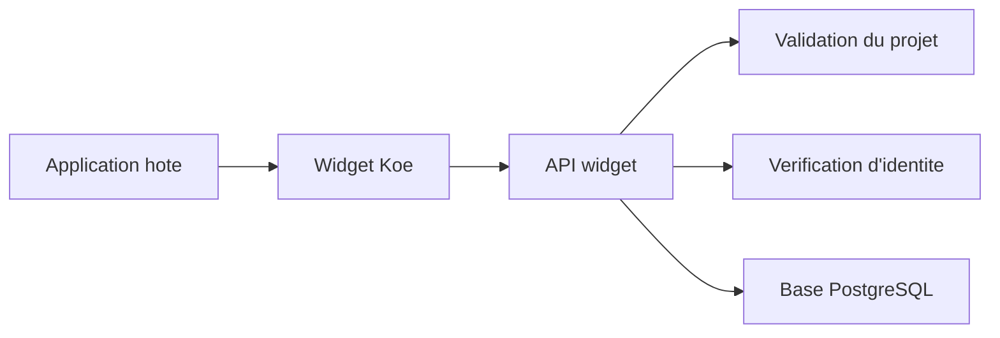

# API Widget

Ce document presente l'API publique consommee par le widget. Il aide les equipes produit et integration a comprendre ce qui est disponible aujourd'hui.

## Pourquoi cette API existe

- Centraliser les bugs et les demandes d'evolution.
- Associer chaque envoi a un projet SaaS precis.
- Exposer un vote public simple pour la roadmap.
- Fournir un socle stable avant l'API d'administration.

## Vue d'ensemble



L'application hote embarque le widget. Le widget appelle l'API publique. L'API verifie le projet et l'identite avant d'ecrire en base.

## Headers obligatoires

| Header                           | Quand                         | Role                                  |
| -------------------------------- | ----------------------------- | ------------------------------------- |
| `X-Koe-Project-Key`              | Toutes les routes widget      | Rattache la requete au bon projet.    |
| `Content-Type: application/json` | Requetes `POST`               | Transporte les formulaires du widget. |
| `X-Koe-User-Hash`                | Si la verification est active | Prouve l'identite du contributeur.    |

## Endpoints disponibles

| Methode | Route                          | Usage                              | Point cle                                  |
| ------- | ------------------------------ | ---------------------------------- | ------------------------------------------ |
| `GET`   | `/health`                      | Verifier la disponibilite de l'API | Retourne `status: ok`.                     |
| `POST`  | `/v1/widget/bugs`              | Creer un signalement de bug        | Attend le contexte navigateur.             |
| `POST`  | `/v1/widget/features`          | Creer une demande d'evolution      | Cree aussi un compteur de vote a `0`.      |
| `GET`   | `/v1/widget/features`          | Lister la roadmap publique         | Accepte `userId` pour calculer `hasVoted`. |
| `POST`  | `/v1/widget/features/:id/vote` | Ajouter ou retirer un vote         | Le second appel retire le vote.            |

## Format des reponses

Les reponses suivent une enveloppe JSON commune. Cela simplifie le traitement cote widget.

```json
{
  "ok": true,
  "data": {
    "id": "ticket_123"
  }
}
```

```json
{
  "ok": false,
  "error": {
    "code": "validation_failed",
    "message": "Invalid bug report payload"
  }
}
```

## Limites et regles importantes

- **Taille des payloads** : l'API refuse tout corps au-dessus de `256 KB`.
- **Screenshots** : le widget envoie une `screenshotUrl`, jamais une image base64 inline.
- **Roadmap publique** : la liste des demandes est limitee a `100` elements.
- **Rate limiting** : l'API applique un quota en memoire par projet et par IP.

> **Detail technique**
> La limite actuelle est de 10 requetes par minute, avec un burst de 30 requetes.

## Hors perimetre actuel

- L'API d'administration n'est pas encore branchee.
- Le chat temps reel n'est pas expose.
- Le dashboard ne consomme pas encore cette API.
