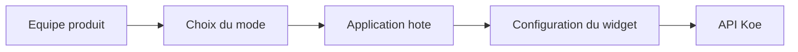

# Integration du widget

Ce document explique comment embarquer Koe dans une application hote. Il s'adresse aux equipes produit, frontend et integration.

## Choisir le bon mode

| Mode                | Quand l'utiliser                           | Particularite                                    |
| ------------------- | ------------------------------------------ | ------------------------------------------------ |
| **Package React**   | Votre application utilise deja React       | Vous importez `KoeWidget` et `style.css`.        |
| **Script autonome** | Vous voulez une integration sans framework | La build IIFE inclut React et expose `Koe.init`. |

## Parcours d'integration



L'equipe choisit un mode d'integration. L'application hote initialise ensuite le widget avec le bon projet et les bonnes options. Le widget appelle enfin l'API Koe.

## Configuration essentielle

| Option       | Obligatoire     | Role                                                                |
| ------------ | --------------- | ------------------------------------------------------------------- |
| `projectKey` | Oui             | Identifie le projet cible.                                          |
| `user`       | Non             | Rattache le ticket a un utilisateur connu.                          |
| `userHash`   | Selon le projet | Active la verification d'identite cote API.                         |
| `apiUrl`     | Non             | Pointe vers l'API. La valeur par defaut vise `https://api.koe.dev`. |
| `position`   | Non             | Place le lanceur dans un coin de l'ecran.                           |
| `theme`      | Non             | Regle la couleur, le mode clair ou sombre et le rayon.              |
| `features`   | Non             | Active ou masque les onglets bugs, evolutions et chat.              |
| `locale`     | Non             | Remplace les textes d'interface.                                    |

## Exemple React

Exemple minimal pour une application React.

```tsx
import { KoeWidget } from '@wifsimster/koe';
import '@wifsimster/koe/style.css';

export function App() {
  return <KoeWidget projectKey="demo" user={{ id: 'u1', email: 'jane@example.com' }} />;
}
```

## Exemple script autonome

Exemple minimal pour une application sans framework.

```html
<link rel="stylesheet" href="https://cdn.koe.dev/style.css" />
<script src="https://cdn.koe.dev/koe.iife.js"></script>
<script>
  Koe.init({
    projectKey: 'demo',
    user: { id: 'u1', email: 'jane@example.com' },
    userHash: 'hash-fourni-par-votre-backend',
  });
</script>
```

## Points d'attention

- **Verification d'identite** : `userHash` doit venir de votre backend.
- **Styles** : la version React attend l'import de `@wifsimster/koe/style.css`.
- **Build autonome** : chargez aussi `style.css` en plus de `koe.iife.js`.
- **Chat** : l'onglet existe, mais il reste local et sans temps reel.
- **Build npm** : React est externe dans le package publie.
- **Build autonome** : React est inclus dans `koe.iife.js`.
- **Metadonnees navigateur** : le widget ajoute automatiquement le contexte utile aux bugs.
