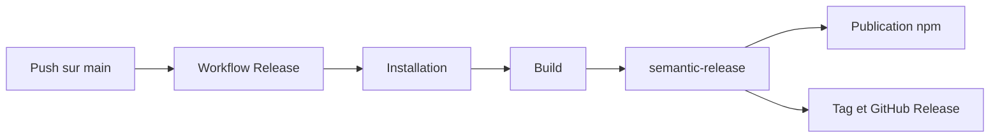

# Release npm

Ce document decrit le pipeline de verification et de publication du projet. Il s'adresse aux equipes produit et techniques qui suivent la diffusion du widget public.

## Ce que le projet publie

| Package           | Statut | Observation                  |
| ----------------- | ------ | ---------------------------- |
| `@wifsimster/koe` | Public | Seul package publie sur npm. |
| `@koe/api`        | Prive  | Non publie.                  |
| `@koe/dashboard`  | Prive  | Non publie.                  |
| `@koe/shared`     | Prive  | Non publie.                  |

## Pipeline actuel

Un push sur `main` lance le workflow de release. Le build est rejoue, puis `semantic-release` analyse les commits Conventional Commits. S'il detecte une release, il publie `@wifsimster/koe` sur npm avec provenance puis cree le tag GitHub et la release associee.

## Verifications automatiques

- **CI** : installation des dependances avec `pnpm install --frozen-lockfile`.
- **Build** : execution de `pnpm turbo run build`.
- **Typecheck** : execution de `pnpm turbo run typecheck`.
- **Lint** : present, mais non bloquant pour le moment.
- **Tests** : presents, mais non bloquants tant que les suites restent peu branchees.
- **Tarball widget** : verification du contenu du package npm en CI.

## Ajouter une release

1. Utiliser des commits Conventional Commits comme `feat(widget): ...` ou `fix(api): ...`.
2. Fusionner sur `main`.
3. Laisser `semantic-release` calculer la version et publier automatiquement.
4. Verifier localement le resultat attendu avec `pnpm release:dry` si besoin.

## Points d'attention

- `NPM_TOKEN` est requis pour publier sur npm.
- Le workflow ne commit pas de changement de version sur `main`.
- `NODE_AUTH_TOKEN` est alimente dans le job a partir de `NPM_TOKEN`.
- Le workflow demande un jeton GitHub pour creer le tag et la GitHub Release.
- La provenance npm est active via `id-token` dans GitHub Actions.
