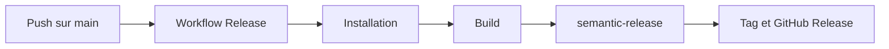

# Release

Ce document decrit le pipeline de release du projet. Il s'adresse aux equipes produit et techniques qui suivent la diffusion du widget public.

## Ce que le projet publie

| Package           | Statut | Observation                                                     |
| ----------------- | ------ | --------------------------------------------------------------- |
| `@wifsimster/koe` | Public | Distribue via tags git et GitHub Releases. Non publie sur npm.  |
| `@koe/api`        | Prive  | Non publie.                                                     |
| `@koe/dashboard`  | Prive  | Non publie.                                                     |
| `@koe/shared`     | Prive  | Non publie.                                                     |

## Pipeline actuel

Un push sur `main` lance le workflow de release. Le build est rejoue, puis `semantic-release` analyse les commits Conventional Commits. S'il detecte une release, il cree un tag `vX.Y.Z` via l'API GitHub et une GitHub Release avec des notes generees automatiquement.

## Verifications automatiques

- **CI** : installation des dependances avec `pnpm install --frozen-lockfile`.
- **Build** : execution de `pnpm turbo run build`.
- **Typecheck** : execution de `pnpm turbo run typecheck`.
- **Lint** : present, mais non bloquant pour le moment.
- **Tests** : presents, mais non bloquants tant que les suites restent peu branchees.

## Ajouter une release

1. Utiliser des commits Conventional Commits comme `feat(widget): ...` ou `fix(api): ...`.
2. Fusionner sur `main`.
3. Laisser `semantic-release` calculer la version et creer le tag et la GitHub Release automatiquement.
4. Verifier localement le resultat attendu avec `pnpm release:dry` si besoin.

## Consommer le widget

Sans publication npm, les consommateurs ont deux options :

- Installer depuis un tag git : `npm install github:Wifsimster/koe#v0.1.0`.
- Charger la build autonome `koe.iife.js` depuis un CDN base sur GitHub, comme jsDelivr.

## Points d'attention

- Aucun secret au-dela du `GITHUB_TOKEN` fourni par defaut par GitHub Actions n'est necessaire.
- Le workflow ne commit pas de changement de version sur `main`.
- Le workflow demande un jeton GitHub pour creer le tag et la GitHub Release.
