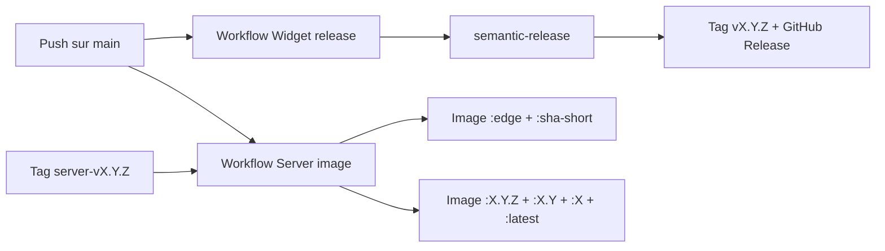

# Release

Ce document decrit le pipeline de release du projet. Il s'adresse aux equipes produit et techniques qui suivent la diffusion du widget public et de l'image Docker du serveur.

## Ce que le projet publie

| Artefact                          | Canal                               | Statut | Observation                                                            |
| --------------------------------- | ----------------------------------- | ------ | ---------------------------------------------------------------------- |
| `@wifsimster/koe` (widget)        | GitHub Releases + tags git `v*`     | Public | Non publie sur npm. Consomme via tag git ou CDN.                       |
| `ghcr.io/wifsimster/koe-server`   | GitHub Container Registry           | Public | Image Docker multi-arch (API + dashboard), signee cosign, SBOM + provenance SLSA. |
| `@koe/api`                        | workspace prive                     | Prive  | Distribue uniquement via l'image Docker.                               |
| `@koe/dashboard`                  | workspace prive                     | Prive  | Embarque dans l'image Docker du serveur.                               |
| `@koe/shared`                     | workspace prive                     | Prive  | Types et helpers internes.                                             |

## Deux pistes de release en parallele



### Widget — `semantic-release`

- Chaque push sur `main` declenche le workflow `Widget release`.
- `semantic-release` analyse les commits Conventional Commits depuis le dernier tag `v*`.
- S'il detecte une release, il cree un tag `vX.Y.Z` via l'API GitHub et une GitHub Release avec des notes generees automatiquement.
- Aucun `CHANGELOG.md` n'est commit sur `main` — les notes vivent sur la page GitHub Releases.

### Serveur — image Docker

- Chaque push sur `main` qui touche `packages/api/**`, `packages/shared/**` ou le lockfile declenche le workflow `Server image`.
- Ce push produit les tags roulants `:edge` et `:sha-<short>` sur `ghcr.io/wifsimster/koe-server`.
- Pour cut une release stable, pousser un tag git `server-vX.Y.Z`. L'image est alors republiee avec les tags `:X.Y.Z`, `:X.Y`, `:X` et `:latest`.
- Les tags `server-v*` sont distincts des tags widget `v*` pour eviter que les releases widget ne churn l'image Docker.

## Verifications automatiques

- **CI** : installation des dependances avec `pnpm install --frozen-lockfile`.
- **Build** : execution de `pnpm turbo run build`.
- **Typecheck** : execution de `pnpm turbo run typecheck`.
- **Lint** : present, mais non bloquant pour le moment.
- **Tests** : presents, mais non bloquants tant que les suites restent peu branchees.
- **Image Docker** : signature keyless cosign, attestation de provenance SLSA (`mode=max`), SBOM, scan Trivy en soft-fail (findings remontes dans l'onglet Security sans bloquer la publication).

## Ajouter une release widget

1. Utiliser des commits Conventional Commits comme `feat(widget): ...` ou `fix(widget): ...`.
2. Fusionner sur `main`.
3. Laisser `semantic-release` calculer la version et creer le tag et la GitHub Release automatiquement.
4. Verifier localement le resultat attendu avec `pnpm release:dry` si besoin.

## Ajouter une release serveur

1. S'assurer que `main` est dans l'etat souhaite (CI verte, migration a jour).
2. Cut un tag local :

   ```bash
   git tag server-v0.1.0
   git push origin server-v0.1.0
   ```

3. Le workflow `Server image` republie l'image avec les tags semver + `latest`.
4. Verifier la publication sur `https://github.com/Wifsimster/koe/pkgs/container/koe-server`.

## Consommer le widget

Sans publication npm, les consommateurs ont deux options :

- Installer depuis un tag git : `npm install github:Wifsimster/koe#v0.1.0`.
- Charger la build autonome `koe.iife.js` depuis un CDN base sur GitHub, comme jsDelivr.

## Consommer l'image serveur

```bash
# Rolling (suit main)
docker pull ghcr.io/wifsimster/koe-server:edge

# Stable (si un tag server-v* a ete cut)
docker pull ghcr.io/wifsimster/koe-server:latest
docker pull ghcr.io/wifsimster/koe-server:0.1.0
```

## Points d'attention

- Aucun secret au-dela du `GITHUB_TOKEN` fourni par defaut par GitHub Actions n'est necessaire.
- Les workflows ne commit pas de changement de version sur `main`.
- `GITHUB_TOKEN` sert a creer les tags widget, publier sur GHCR et signer les images via cosign (OIDC keyless).
- Les tags git `v*` (widget) et `server-v*` (image) cohabitent sans se chevaucher.
