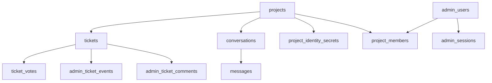

# Schema de base de donnees

Ce document presente les tables principales de Koe. Il aide a comprendre ce que le produit stocke et pourquoi chaque table existe.

## Role du schema

- Porter un modele multi-projets.
- Stocker bugs et demandes d'evolution dans un format commun.
- Supporter le vote public sans compteur fragile.
- Tracer les actions admin et l'authentification.
- Preparer le futur module de conversation.

## Vue d'ensemble

Un projet regroupe tickets, conversations, secrets d'identite et membres admin. Les utilisateurs admin sont globaux ; leur appartenance a un projet est portee par `project_members`.

## Tables principales

### Flux widget

| Table                        | Role                                                    | Champs marquants                                              |
| ---------------------------- | ------------------------------------------------------- | ------------------------------------------------------------- |
| `projects`                   | Definit un projet SaaS                                  | `key`, `allowedOrigins`, `identitySecret`, `lastPingAt`       |
| `project_identity_secrets`   | Secrets HMAC versionnes par `kid` pour la rotation      | `(projectId, kid)`, `status: active / retiring / revoked`     |
| `tickets`                    | Bugs et demandes d'evolution                            | `kind`, `status`, `priority`, `isPublicRoadmap`, `metadata`   |
| `ticket_votes`               | Vote public sur les demandes d'evolution                | Cle primaire `(ticketId, userId)` — pas de double-vote        |
| `conversations` / `messages` | Infrastructure du chat (non actif)                      | `lastMessageAt`, `authorKind`, `readAt`                       |

### Flux admin

| Table                    | Role                                                      | Champs marquants                                       |
| ------------------------ | --------------------------------------------------------- | ------------------------------------------------------ |
| `admin_users`            | Identites humaines du dashboard (globales, multi-projet)  | `email`, `passwordHash` (argon2id, NULL en OIDC)       |
| `admin_sessions`         | Sessions admin                                            | `tokenHash` (SHA-256 du token), `expiresAt`            |
| `project_members`        | Appartenance projet-utilisateur + role                    | `(projectId, userId)`, `role: owner / member / viewer` |
| `admin_ticket_events`    | Trail d'audit des mutations de ticket                     | `kind`, `payload` (JSON), `batchId` (bulk)             |
| `admin_ticket_comments`  | Commentaires internes non exposes au reporter             | `authorUserId`, `body`                                 |

## Decisions metier importantes

- **Bugs et demandes** partagent la table `tickets`.
- **Votes** : chaque vote est une ligne distincte ; la cle composite empeche le double vote.
- **Rotation des secrets** : plusieurs `kid` peuvent etre actifs en parallele. Le verifier essaye chacun pendant la fenetre de rotation.
- **Audit transactionnel** : un `PATCH /tickets/:id` ecrit l'update et l'evenement d'audit dans la meme transaction. Les valeurs possibles de `ticket_event_kind` sont `status_changed`, `priority_changed` et `roadmap_toggled` — cette derniere est emise quand un admin bascule `is_public_roadmap` et reste reversible depuis la timeline comme les deux autres.
- **Roadmap publique opt-in** : `tickets.is_public_roadmap` (defaut `false`) controle la visibilite sur `/r/:projectKey`. Un index partiel `tickets_project_public_roadmap_idx` sur `(project_id, status) WHERE is_public_roadmap = true` garde la page rapide meme quand la table grossit.
- **Correlation des actions en lot** : tous les evenements issus d'un meme bulk partagent le meme `batchId`. Un revert s'effectue par `batchId`.
- **Suppression d'un admin** : `ON DELETE SET NULL` sur `assignedToUserId`, `actorUserId` et `authorUserId`. L'historique survit au depart d'une personne.
- **Screenshots** : seule une URL est stockee, jamais l'image binaire.
- **Secrets au repos** : `identitySecret` et `project_identity_secrets.secret` sont chiffrables via `KOE_SECRET_KEYS` (AES-256-GCM enveloppe).

## Heartbeat projet

`projects.lastPingAt` et `lastPingOrigin` sont stampes par le middleware de resolution a chaque requete widget. Le dashboard expose un indicateur « Last ping from yoursite.com, 3 min ago » sur l'etat vide — c'est ce qui permet a un operateur de verifier que son `<script>` est bien charge.

> **Detail technique**
> Colonnes non indexees. Lecture uniquement sur la page d'overview d'un projet.

## Impact des changements

- Modifier `packages/api/src/db/schema.ts` implique de generer une migration :
  1. `pnpm --filter @koe/api db:generate`
  2. Commiter la migration dans `packages/api/src/db/migrations/`
  3. `pnpm --filter @koe/api db:migrate` pour l'appliquer localement
- Un changement de contrat visible cote widget doit rester coherent avec `@koe/shared`.
- Un ajout d'enum Postgres est une DDL a part : forward-lister les valeurs futures coute peu et evite des migrations ulterieures.
