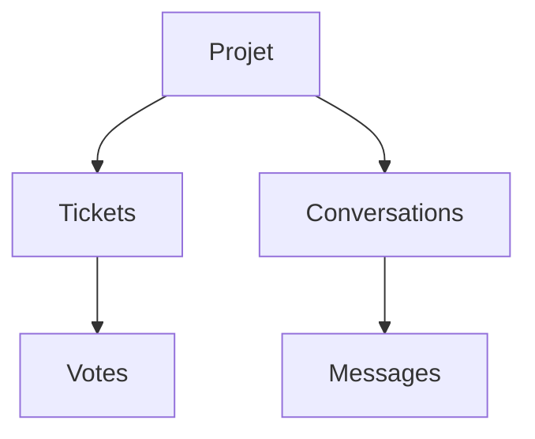

# Schema de base de donnees

Ce document presente les tables principales de Koe. Il aide a comprendre ce que le produit stocke deja et ce qui prepare les prochaines fonctionnalites.

## Role du schema

- Porter un modele multi-projets.
- Stocker bugs et demandes d'evolution dans un format commun.
- Supporter le vote public sans compteur fragile.
- Preparer le futur module de conversation.

## Vue d'ensemble

Un projet regroupe les tickets et les conversations. Les votes ne concernent que les demandes d'evolution. Les conversations et messages preparent le chat futur.

## Tables principales

| Table           | Role                         | Champs marquants                                          |
| --------------- | ---------------------------- | --------------------------------------------------------- |
| `projects`      | Definit un projet SaaS       | `key`, `name`, `allowedOrigins`, `identitySecret`         |
| `tickets`       | Regroupe bugs et demandes    | `kind`, `status`, `priority`, `metadata`, `screenshotUrl` |
| `ticket_votes`  | Porte les votes utilisateurs | `ticketId`, `userId`, cle primaire composite              |
| `conversations` | Prepare le suivi chat        | `projectId`, `userId`, `lastMessageAt`                    |
| `messages`      | Prepare l'historique chat    | `conversationId`, `authorKind`, `body`, `readAt`          |

## Decisions metier importantes

- **Bugs et demandes** partagent la table `tickets`.
- **Votes** : chaque vote est une ligne distincte dans `ticket_votes`.
- **Compteur de vote** : il est calcule a la lecture.
- **Verification d'identite** : `reporterVerified` garde la trace d'un hash valide.
- **Origines autorisees** : `allowedOrigins` protege l'usage du widget.
- **Screenshots** : seule une URL est stockee, pas le fichier binaire.

> **Detail technique**
> La cle primaire composite `(ticket_id, user_id)` empeche le double vote au niveau base de donnees.

## Impact des changements

- Modifier `packages/api/src/db/schema.ts` implique le workflow Drizzle.
- Il faut ensuite lancer `db:generate` puis `db:migrate`.
- Un changement de contrat doit rester coherent avec `@koe/shared`.
