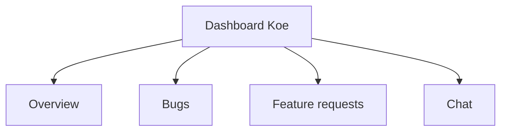

# Statut du dashboard

Ce document clarifie l'etat reel du back-office Koe. Il aide les equipes produit a distinguer ce qui est deja utilisable de ce qui reste prepare.

## Vue d'ensemble

Le dashboard expose deja la navigation principale. Chaque page prepare un usage cible. Les donnees reelles restent a brancher.

## Ce qui existe aujourd'hui

| Route       | Etat    | Observation                                       |
| ----------- | ------- | ------------------------------------------------- |
| `/`         | Present | Page d'ensemble avec cartes de stats placeholder. |
| `/bugs`     | Present | Page d'attente pour de futurs bugs admin.         |
| `/features` | Present | Page d'attente pour la priorisation produit.      |
| `/chat`     | Present | Page d'attente pour le futur chat temps reel.     |

## Ce qui n'est pas encore branche

- **API d'administration** : aucun endpoint admin actif n'apparait dans ce snapshot.
- **Authentification** : le code du dashboard ne montre pas de branchement actif.
- **Donnees reelles** : les compteurs et listes restent vides.
- **Chat temps reel** : aucune connexion WebSocket n'est branchee.

## Consequence pour le produit

- La valeur livrable actuelle repose surtout sur le widget et l'API publique.
- Le dashboard sert de squelette produit et de base de navigation.
- Une equipe de support ne peut pas encore piloter les tickets depuis cette interface.

## Priorites conseillees

- Ajouter une API d'administration coherente avec le modele `tickets`.
- Brancher les pages `bugs` et `features` sur des donnees reelles.
- Choisir puis cabler une strategie d'authentification.
- Finaliser ensuite le chat temps reel et ses notifications.
