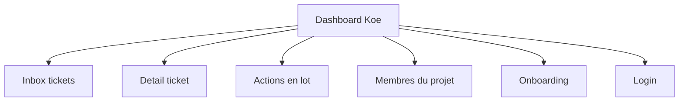
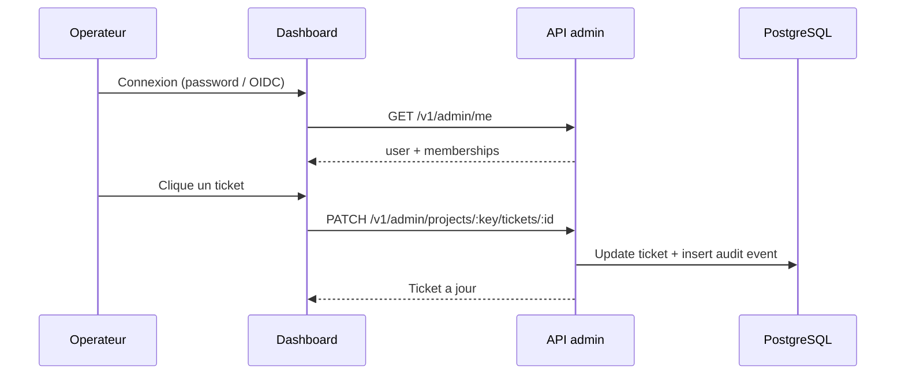

# Statut du dashboard

Ce document clarifie l'etat reel du back-office Koe. Il aide les equipes produit a distinguer les flux deja branches des zones encore partielles.

## Vue d'ensemble

Le dashboard est servi par l'API a `/admin/` quand `ENABLE_DASHBOARD=true`. L'API d'administration a `/v1/admin/*` est montee separement via `ADMIN_AUTH_MODE`.

## Pages reellement fonctionnelles

| Route                        | Etat         | Role                                                                                             |
| ---------------------------- | ------------ | ------------------------------------------------------------------------------------------------ |
| `/login`                     | Fonctionnel  | Auth via password ou OIDC selon `ADMIN_AUTH_MODE`.                                               |
| `/onboarding`                | Fonctionnel  | Creation du premier projet pour un nouveau compte admin.                                         |
| `/`                          | Fonctionnel  | Inbox des tickets : filtres par kind, statut, priorite, assignation. Actions en lot possibles.    |
| `/tickets/$id`               | Fonctionnel  | Detail d'un ticket : modification statut / priorite / assignation, commentaires internes, audit. |
| `/batches`                   | Fonctionnel  | Historique des actions en lot. Revert par `batchId` disponible.                                  |
| `/projects/$key/members`     | Fonctionnel  | Invitation et gestion des membres. Roles `owner`, `member`, `viewer`.                            |

## Modes d'authentification

Trois modes sont branches, selectionnes via `ADMIN_AUTH_MODE` :

| Mode          | Usage recommande                | Mecanisme                                                               |
| ------------- | ------------------------------- | ----------------------------------------------------------------------- |
| `password`    | Self-host simple                | Email + mot de passe. Hash argon2id. Utilisateurs seedes via CLI.       |
| `oidc`        | Organisation avec IdP existant  | OpenID Connect generique (Auth0, Clerk, Keycloak, Google, WorkOS…).     |
| `dev-session` | Local et staging                | Token bearer minte par le CLI `admin-session`. Refuse en production.    |

Les sessions sont stockees en base sous forme de hash SHA-256. Un dump DB ne fuite pas de credentials actifs.

## Flux de travail type

L'operateur se connecte, selectionne un projet et ouvre un ticket. Toute modification emet un evenement d'audit dans la meme transaction que l'update.

## Ce qui reste partiel

- **Chat temps reel** : aucune connexion WebSocket. L'onglet du widget affiche une conversation locale.
- **Notifications** : pas de mail, pas de webhook. Les actions ne declenchent aucune alerte sortante.
- **Self-service pour password** : pas de reset automatique. Relancer le CLI `admin-user` pour changer un mot de passe.

## Consequence pour le produit

- Une equipe de support peut deja piloter l'inbox, assigner, commenter et revenir en arriere sur une action en lot.
- Le trail d'audit est complet pour les changements de statut et de priorite.
- Une application hote peut onboarder un admin, creer un projet, puis recevoir les tickets du widget.

## Priorites conseillees

- Brancher le chat temps reel (WebSocket et historique admin-cote).
- Ajouter une couche de notifications sortantes.
- Exposer un flot de reset de mot de passe en mode `password`.
