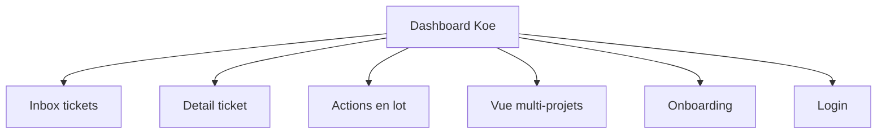
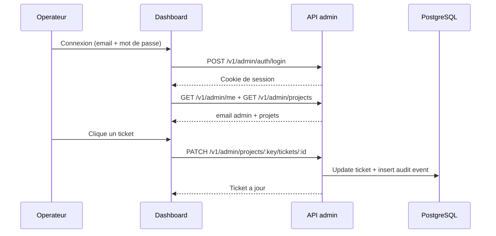

# Statut du dashboard

Ce document clarifie l'etat reel du back-office Koe. Il aide les equipes produit a distinguer les flux deja branches des zones encore partielles.

## Vue d'ensemble

```mermaid
graph TD
    A[Dashboard Koe] --> B[Inbox tickets]
    A --> C[Detail ticket]
    A --> D[Actions en lot]
    A --> E[Vue multi-projets]
    A --> F[Onboarding]
    A --> G[Login]
```

Le dashboard est servi par l'API a `/admin/` quand `ENABLE_DASHBOARD=true` (`false` par defaut via `docker-compose.yml`, `true` s'il n'est pas defini hors compose). L'API d'administration a `/v1/admin/*` est montee separement, uniquement si `ADMIN_EMAIL`, `ADMIN_PASSWORD_HASH` et `ADMIN_SESSION_SECRET` sont tous definis.

## Pages reellement fonctionnelles

| Route                        | Etat         | Role                                                                                             |
| ---------------------------- | ------------ | ------------------------------------------------------------------------------------------------ |
| `/login`                     | Fonctionnel  | Auth email + mot de passe de l'admin unique (`ADMIN_EMAIL` / `ADMIN_PASSWORD_HASH`).             |
| `/onboarding`                | Fonctionnel  | Creation du premier projet quand l'instance n'en a encore aucun.                                 |
| `/`                          | Fonctionnel  | Inbox des tickets : filtres par kind et statut, recherche, tri. Actions en lot possibles.         |
| `/tickets/$id`               | Fonctionnel  | Detail d'un ticket : modification statut / priorite, notes privees, roadmap publique, audit.     |
| `/overview`                  | Fonctionnel  | Vue multi-projets : une tuile de KPI par projet.                                                 |

## Authentification

Koe est single-admin : un seul flux, email + mot de passe, sans table d'utilisateurs, sans roles ni membres par projet.

| Variable               | Role                                                                            |
| ---------------------- | ------------------------------------------------------------------------------- |
| `ADMIN_EMAIL`          | Email de l'admin unique.                                                        |
| `ADMIN_PASSWORD_HASH`  | Hash argon2id, genere via `docker compose run --rm api hash-password`.          |
| `ADMIN_SESSION_SECRET` | Cle HMAC des cookies de session. La faire tourner invalide toutes les sessions. |

Les trois non definies : pas d'API admin (defaut sur). Une configuration partielle (`ADMIN_EMAIL` ou `ADMIN_PASSWORD_HASH` sans les trois) fait refuser le demarrage.

Les sessions sont stockees en base (`admin_sessions`) sous forme de hash SHA-256. Un dump DB ne fuite pas de credentials actifs, et le logout revoque la session cote serveur.

## Flux de travail type

```mermaid
sequenceDiagram
    participant O as Operateur
    participant D as Dashboard
    participant A as API admin
    participant DB as PostgreSQL
    O->>D: Connexion (email + mot de passe)
    D->>A: POST /v1/admin/auth/login
    A-->>D: Cookie de session
    D->>A: GET /v1/admin/me + GET /v1/admin/projects
    A-->>D: email admin + projets
    O->>D: Clique un ticket
    D->>A: PATCH /v1/admin/projects/:key/tickets/:id
    A->>DB: Update ticket + insert audit event
    A-->>D: Ticket a jour
```

L'operateur se connecte, selectionne un projet et ouvre un ticket. Toute modification emet un evenement d'audit dans la meme transaction que l'update.

## Ce qui reste partiel

- **Chat temps reel** : aucune connexion WebSocket. L'onglet du widget affiche une conversation locale.
- **Notifications** : un email Resend par nouveau ticket widget si `RESEND_API_KEY` est defini. Pas de webhook, et les actions admin ne declenchent aucune alerte sortante.
- **Self-service pour password** : pas de reset automatique. Pour changer le mot de passe, generer un nouveau hash via `hash-password`, mettre a jour `ADMIN_PASSWORD_HASH` et redemarrer.

## Consequence pour le produit

- L'admin peut deja piloter l'inbox, annoter les tickets en notes privees et revenir en arriere evenement par evenement depuis la timeline.
- Le trail d'audit est complet pour les changements de statut et de priorite.
- Une instance fraichement configuree peut creer un projet via l'onboarding, puis recevoir les tickets du widget.

## Priorites conseillees

- Brancher le chat temps reel (WebSocket et historique admin-cote).
- Etendre les notifications sortantes (webhooks, alertes sur actions admin).
- Exposer un flot de reset de mot de passe.
