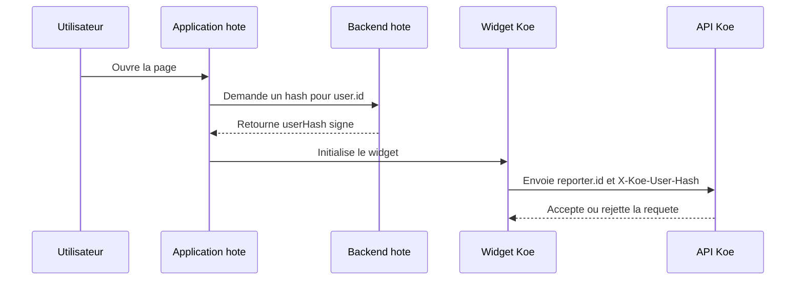

# Verification d'identite

Ce document explique comment Koe verifie l'identite d'un contributeur. Il sert aux equipes produit et backend qui integrent le widget dans une application hote.

## Pourquoi ce mecanisme existe

- Le **projectKey** est public par nature.
- Une application malveillante pourrait sinon usurper un utilisateur.
- Le vote public deviendrait facile a manipuler.
- Le hash HMAC permet de verifier l'identite sans exposer le secret.

## Flux de verification



Le secret reste cote backend hote. Le widget ne recoit qu'un hash opaque. L'API Koe recalcule le hash attendu avant d'accepter l'action.

## Regles a retenir

- **Secret de projet** : il ne doit jamais sortir du backend hote.
- **Algorithme** : Koe attend `hex(HMAC-SHA256(identitySecret, user.id))`.
- **Header transporte** : le widget envoie ce hash dans `X-Koe-User-Hash`.
- **Mode permissif** : si `requireIdentityVerification` est faux, le hash reste optionnel.
- **Mode strict** : si `requireIdentityVerification` est vrai, un hash absent ou faux renvoie `401`.
- **Trace metier** : un hash valide positionne `reporterVerified` a `true`.

## Exemple cote backend

Le backend hote peut generer le hash avec quelques lignes de code.

```ts
import { createHmac } from 'node:crypto';

export function signKoeUser(userId: string, secret: string) {
  return createHmac('sha256', secret).update(userId).digest('hex');
}
```

## Cas de rejet frequents

| Situation                               | Resultat                  | Effet                                     |
| --------------------------------------- | ------------------------- | ----------------------------------------- |
| `X-Koe-Project-Key` absent              | `401 invalid_project_key` | Le projet ne peut pas etre resolu.        |
| `X-Koe-User-Hash` absent en mode strict | `401 unauthorized`        | La contribution est refusee.              |
| Hash different du hash attendu          | `401 unauthorized`        | L'identite est consideree comme invalide. |
| Origine non autorisee                   | `403 origin_not_allowed`  | La requete est bloquee avant l'ecriture.  |

## Conseils d'integration

- Generer le hash au chargement de la page ou via un endpoint dedie.
- Recalculer le hash si `user.id` change.
- Ne jamais construire ce hash dans le navigateur.
