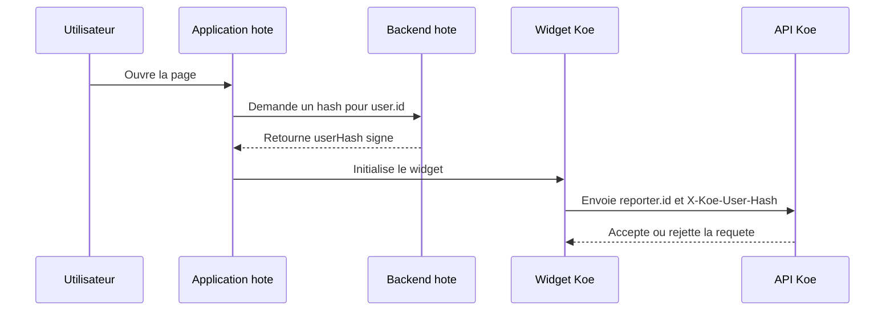

# Verification d'identite

Ce document explique comment Koe verifie l'identite d'un contributeur. Il sert aux equipes produit et backend qui integrent le widget dans une application hote.

## Pourquoi ce mecanisme existe

- Le **projectKey** est public par nature.
- Une application malveillante pourrait sinon usurper un utilisateur.
- Le vote public deviendrait facile a manipuler.
- Un secret partage permet de verifier l'identite sans l'exposer au navigateur.

## Deux schemas coexistent

| Schema              | Header transporte       | Etat                        | Quand l'utiliser                                        |
| ------------------- | ----------------------- | --------------------------- | ------------------------------------------------------- |
| v1 — HMAC simple    | `X-Koe-User-Hash`       | Retro-compatible            | Integrations existantes. Pas de rotation non-breaking.  |
| v2 — Token signe    | `X-Koe-Identity-Token`  | Recommande                  | Nouvelles integrations. TTL, anti-rejeu, rotation `kid`.|

Un meme projet accepte les deux formats simultanement. Un front peut migrer sans casser.

## Flux de verification (v1 — HMAC)



Le secret reste cote backend hote. Le widget ne recoit qu'un hash opaque. L'API Koe recalcule le hash attendu avant d'accepter l'action.

## Regles v1

- **Algorithme** : `hex(HMAC-SHA256(identitySecret, user.id))`.
- **Mode permissif** : si `requireIdentityVerification` est faux, le hash reste optionnel.
- **Mode strict** : si `requireIdentityVerification` est vrai, un hash absent ou faux renvoie `401`.
- **Trace metier** : un hash valide positionne `reporterVerified` a `true`.

Exemple backend :

```ts
import { createHmac } from 'node:crypto';

export function signKoeUser(userId: string, secret: string) {
  return createHmac('sha256', secret).update(userId).digest('hex');
}
```

## Schema v2 — token signe

Le token v2 lie la signature a plusieurs claims pour durcir le modele de menace :

| Claim         | Role                                                                  |
| ------------- | --------------------------------------------------------------------- |
| `reporterId`  | Identifie le contributeur (equivalent `user.id`).                     |
| `projectId`   | Empeche la reutilisation d'un token d'un autre projet.                |
| `iat`         | Seconds since epoch. Borne contre `now - maxAge` (defaut 10 minutes). |
| `nonce`       | Chaine opaque. Deduplique dans un cache partage.                      |
| `kid`         | Version du secret ayant signe. Permet la rotation non-breaking.       |

Format de transport : `base64url(payloadJson).hex(hmacSha256(secret, payloadJson))` dans `X-Koe-Identity-Token`.

> **Detail technique**
> Le cache anti-rejeu utilise la memoire en mono-pod et Redis (`REDIS_URL`) des qu'il y a plusieurs replicas. Sans Redis multi-pod, l'anti-rejeu est per-instance et donc cassable.

## Rotation du secret

Le schema v2 permet de faire tourner le secret sans downtime :

1. Ajouter un nouveau `kid` via le CLI : `rotate-secrets --new-kid v2 --apply`.
2. Basculer les nouvelles signatures sur ce `kid` cote backend hote.
3. Une fois toutes les sessions expirees, marquer l'ancien `kid` comme `retiring` puis `revoked`.

Les secrets en base peuvent aussi etre chiffres au repos via `KOE_SECRET_KEYS` (AES-256-GCM enveloppe).

## Cas de rejet frequents

| Situation                                  | Code                         | Effet                                       |
| ------------------------------------------ | ---------------------------- | ------------------------------------------- |
| `X-Koe-Project-Key` absent                 | `401 invalid_project_key`    | Le projet ne peut pas etre resolu.          |
| Hash/token absent en mode strict           | `401 unauthorized`           | La contribution est refusee.                |
| Hash v1 invalide                           | `401 unauthorized`           | L'identite est consideree comme invalide.   |
| Token v2 expire (`iat` hors fenetre)       | `401 token_expired`          | La signature etait correcte mais trop vieille. |
| Token v2 rejoue (`nonce` deja vu)          | `401 replayed_nonce`         | Dedup anti-rejeu.                           |
| Token v2 signe par un `kid` revoque        | `401 revoked_kid`            | Le secret n'est plus accepte.               |
| Origine non autorisee                      | `403 origin_not_allowed`     | Bloque avant ecriture.                      |

## Conseils d'integration

- Generer le hash ou le token au chargement de la page ou via un endpoint dedie.
- Recalculer si `user.id` change.
- Ne jamais construire la signature dans le navigateur.
- Preferer v2 des qu'une rotation de secret est probable.
